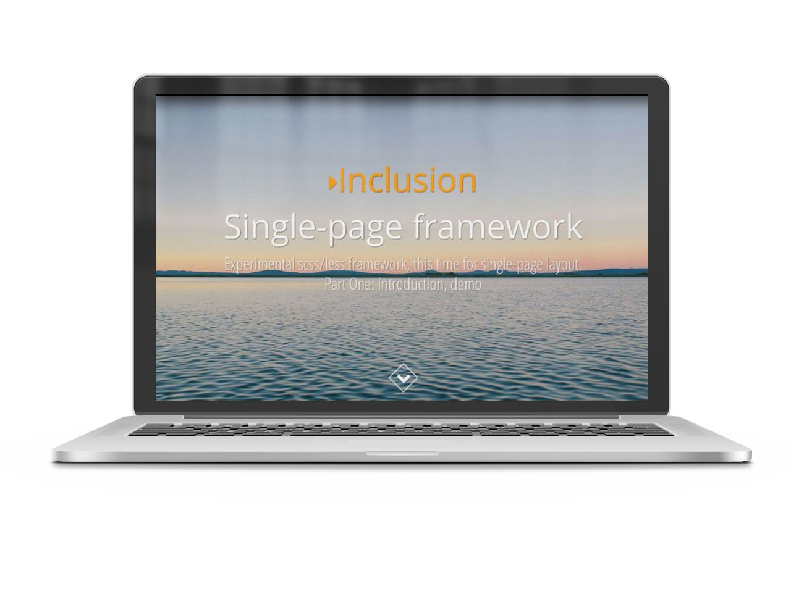

# Inclusion. Sass / Less Framework

##Contents
* [About](#about)
* [How to start](#how-to-start)
    - [Structure](#structure)
    - [HTML and CSS naming](#html-and-css-naming)
    - [Dependencies](#dependencies)
    - [Sublime snippets](#sublime-snippets)
* [Live examples](#live-examples)
* [TODO](#todo)
* [Changelog](#changelog)
* [Credits](#credits)
* [License](#license)

## About
Inclusion is lightweight preprocessor single-page framework with next features:

* Simple and minimalist design
* Responsive layout
* Light and dark color schemes
* Clean typography
* Ready-to-use common elements 
* DRY output css code

And extra options:

* Extra positioned elements
* Grid mixin for custom grids
* Custom color schemes
* jQuery lazy image loading and image preview

## How To Start
Want to learn more about Inclusion, see demo or start using it? - Follow this: [Demo](http://orlovmax.com/lab/tools/inclusion) and [Tutorial](http://orlovmax.com/lab/tools/inclusion_dark-side).
For further development you should use grunt and bower, see more details about grunt installation [here](https://github.com/orlovmax/front-end-scaffold#how-to-start) and about bower [here](https://github.com/orlovmax/front-end-scaffold#bower)

To compile this project, please run the following:

* `npm install` - install grunt packages
* `bower install` - install dependencies
    - `grunt bower-dev` - compile dependencies and remove bower_components folder
* `grunt` - default task, compile project files

To create build version, please run build task:
* `grunt build`

##Structure
This project based on [frontend-scaffold](https://github.com/orlovmax/front-end-scaffold):

`/dev/` folder - contains source code.

`/build/` folder - build version, in our case - demo.

### HTML and CSS naming

For this project I've used BEM naming: `.block` for independent block. `.block__element` for elements inside this block. And `.block_modifier` for modification of this block.

States of the form error messages use prefix `.is-*`. For example `.is-email` - means email error, `.is-success` - success of form validation and sending.

Js hooks use prefix `.js-*`.

###Dependencies
Inclusion plugins require jQuery library. So this dependency was included into `bower.json` for the further development.

###Sublime snippets
I don't like to keep in mind all those mixin names, so I've created this snippets for Subime text2, with shortkeys like `ifi` - which means inclusion figure image. In markup (jade or html) it will create markup for figure element with img tag with necessary classnames and figcaption. In scss it will create empty rule with included mixin. In both cases there will be multiple cursor anchors. Soon I'll add a list with shortkeys.

## Live examples
* [Simple contact form](http://orlovmax.com/lab/simple-contact-form)
* [Browser update screen](http://orlovmax.com/lab/browser-update-screen)
* [Pixel perfect tool](http://orlovmax.com/lab/tools/pixel-perfect-dev)
* [Vertical timeline](http://orlovmax.com/lab/vertical-responsive-timeline)
* [Inclusion: dark side](http://orlovmax.com/lab/tools/inclusion_dark-side)
* [Inclusion](http://orlovmax.com/lab/tools/inclusion)

## TODO
* Shortkeys list for snippets. Make snippet completion or something like that.
* Less version
* Version with mixins instead extends
* No-preprocessor version

## Changelog
* v1.2 (November 08, 2014)
  - Sublime snippets added, selection mixin added
* v1.1 (November 04, 2014)
  - Stable version
* v1.0 (August --, 2014)
  - Initial commit

## Credits
* [jQuery](http://jquery.com) jQuery is a fast, small, and feature-rich JavaScript library. It makes things like HTML document traversal and manipulation, event handling, animation, and Ajax much simpler with an easy-to-use API that works across a multitude of browsers.
* [Lazy load plugin](http://www.appelsiini.net/projects/lazyload) Lazy Load is delays loading of images in long web pages. Images outside of viewport are not loaded until user scrolls to them.
* [Intense Image Viewer](http://tholman.com/intense-images/) A javascript library for viewing images in a fully full screen.
* [Prism syntax highlighter](http://prismjs.com/download.html) Prism is a lightweight, extensible syntax highlighter, built with modern web standards in mind.
* [Lazy load plugin](http://www.appelsiini.net/projects/lazyload) Lazy Load is delays loading of images in long web pages. Images outside of viewport are not loaded until user scrolls to them.
* [Detect Mobile Browsers](http://detectmobilebrowsers.com/) Open source mobile phone detection
* Product mockup created with [http://frame.lab25.co.uk/](http://frame.lab25.co.uk/)

## License
[MIT](http://opensource.org/licenses/MIT)